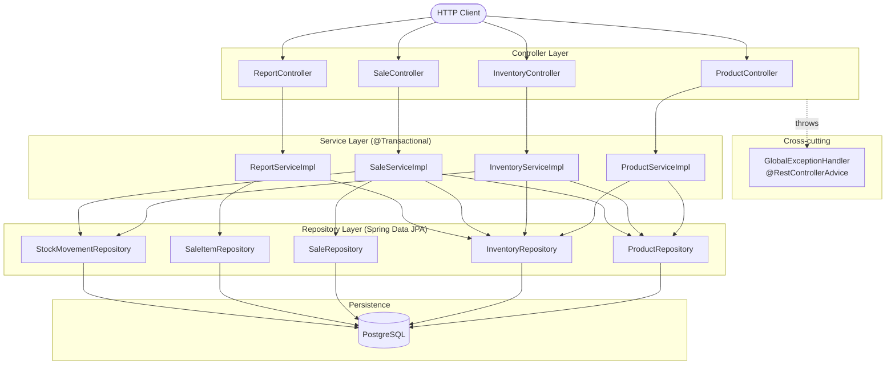
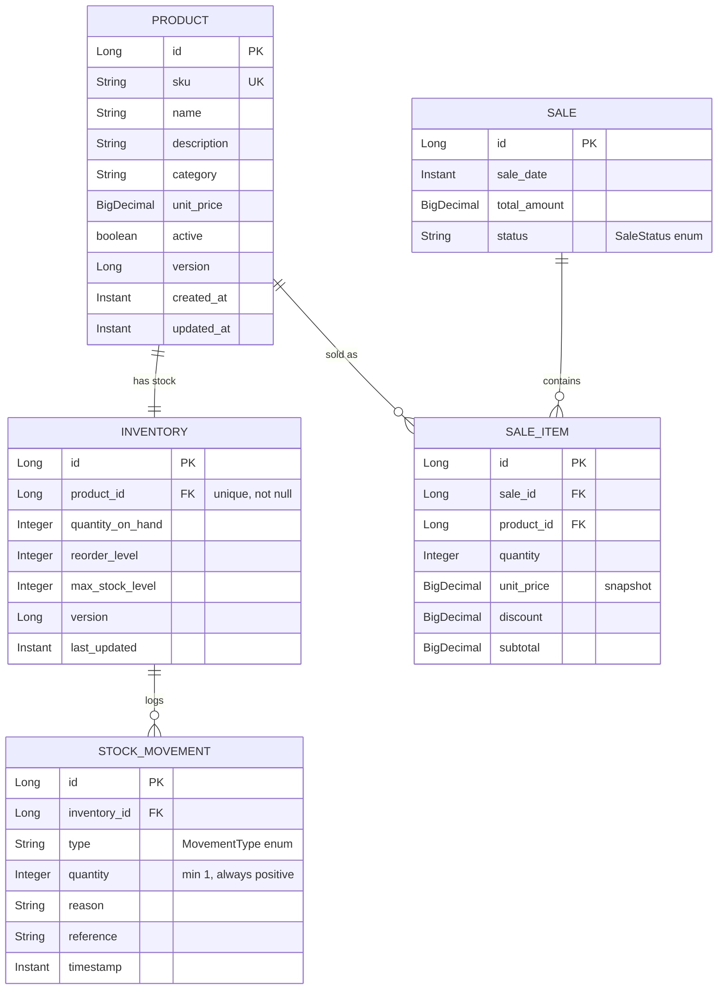
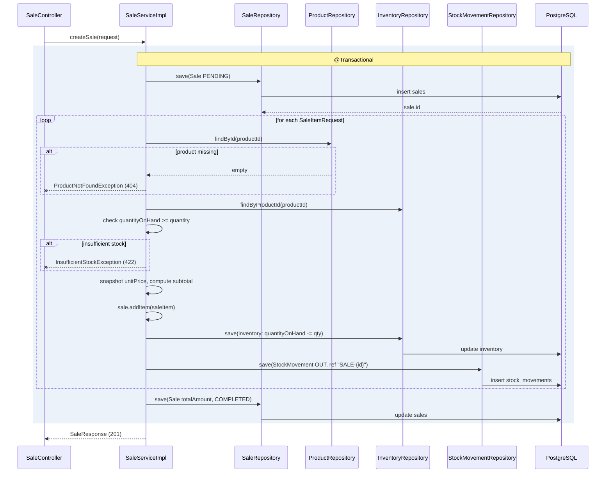
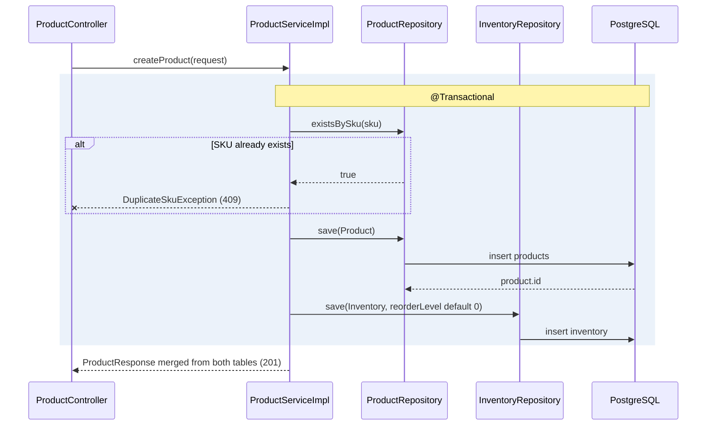
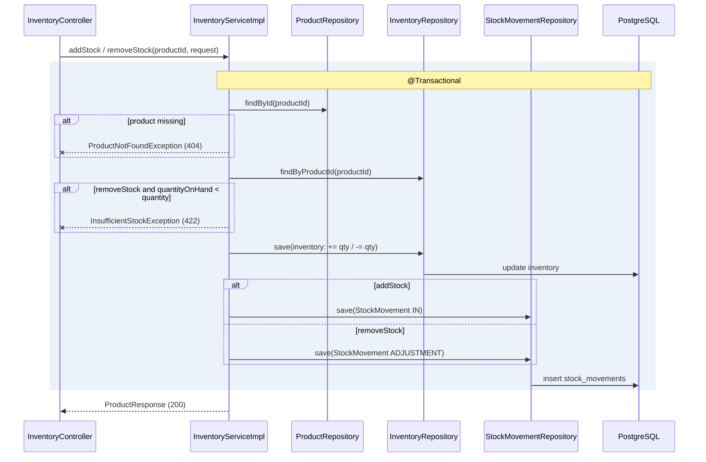
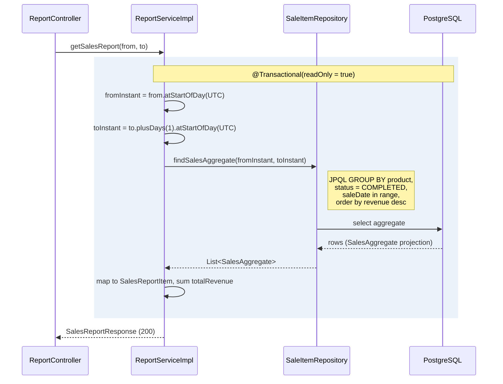
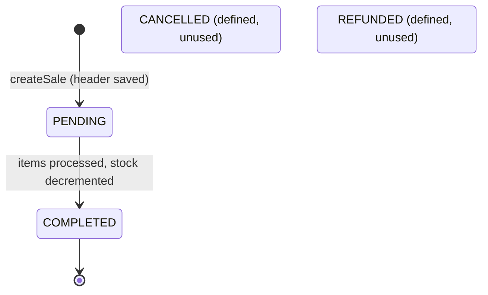

# Inventory Management System — Technical Specification

## 1. Overview

A Spring Boot backend for managing a product catalog, its stock levels, and
the sales that draw stock down. The design keeps three concerns deliberately
separate:

- **Catalog vs. stock.** A `Product` holds the descriptive, priceable facts
  about a SKU — name, description, category, unit price, active flag. The
  quantity on hand lives on a paired `Inventory` row, one-to-one with the
  product. Catalog edits and stock edits therefore never contend on the same
  record, and the two evolve on their own optimistic-locking clocks.
- **Append-only audit.** Stock is never moved silently. Every restock, sale,
  or manual correction writes a `StockMovement` row in the same transaction
  that mutates `Inventory.quantityOnHand`. That log is the single source of
  truth for how a number got where it is, and it backs both the audit trail
  and the reporting queries without anything having to be recomputed after
  the fact.
- **Price snapshotting.** A `SaleItem` records the `unitPrice` in force at the
  moment of sale, not a live reference to the product. Historical sales
  reports aggregate those snapshots, so a later price change can never make an
  old report drift.

The service is a plain layered CRUD-plus-transactions backend: no messaging,
no caching, no auth yet. It exposes a REST API on port `8080` and persists to
PostgreSQL.

## 2. Technology Stack

| Concern | Choice |
|---|---|
| Language | Java 17 |
| Framework | Spring Boot 3.3.4 |
| Build | Gradle (`io.spring.dependency-management` 1.1.6) |
| Web layer | Spring Web (MVC, REST controllers) |
| Persistence | Spring Data JPA (Hibernate) |
| Validation | Spring Validation (Jakarta Bean Validation) |
| Database | PostgreSQL |
| Boilerplate | Lombok |
| Testing | JUnit 5 + Mockito |

Configuration lives in `src/main/resources/application.properties`. The
datasource URL points at `jdbc:postgresql://localhost:5432/inventory_db`;
`DB_USERNAME` defaults to `postgres`, and `DB_PASSWORD` is required with no
default — the app fails to start without it. `spring.jpa.hibernate.ddl-auto`
is `update` (schema auto-created for development).

## 3. Architecture

The system is a conventional four-layer stack. HTTP requests land on a
`@RestController`, which delegates to a `Service` interface. The `*Impl` bean
holds all business logic and transaction boundaries, and reaches the database
only through Spring Data JPA repositories, which map to entities backed by
PostgreSQL tables.

The service layer is where the interesting fan-out is. Anything that touches
stock has to coordinate three tables at once — the product it is selling or
adjusting, the inventory row it decrements or increments, and the stock
movement it appends — so `SaleServiceImpl` and `InventoryServiceImpl` each
depend on `ProductRepository`, `InventoryRepository`, and
`StockMovementRepository`. `ProductServiceImpl` writes both the catalog row
and its paired inventory row, so it depends on `ProductRepository` and
`InventoryRepository`. `ReportServiceImpl` only reads, and reads from two
sources: `InventoryRepository` for stock snapshots and `SaleItemRepository`
for the sales aggregate.

`GlobalExceptionHandler` is a cross-cutting `@RestControllerAdvice`. It is not
part of any single controller; it wraps the whole web layer, translating
domain exceptions thrown anywhere below into the correct HTTP status and a
uniform `ErrorResponse` body.

## 4. Data Model

Five entities. `Product` and `Inventory` are a strict one-to-one pair, with
the foreign key and its uniqueness constraint owned by `Inventory`
(`@OneToOne(optional = false)` on a unique `product_id` column). A `Sale`
owns its `SaleItem` lines (`@OneToMany(mappedBy = "sale")`, cascade `ALL`,
`orphanRemoval = true`); each line points back at a `Product` through a
`@ManyToOne`. Every `StockMovement` hangs off an `Inventory` row through a
`@ManyToOne` — **not** off a product directly, and there is **no** direct
`Product`–`Sale` edge; a product only reaches a sale through a `SaleItem`.

The two enums are persisted as `EnumType.STRING` columns, not as tables:
`MovementType` on `stock_movements.type` and `SaleStatus` on `sales.status`.
They are shown below as attributes.

### Entity key fields

| Entity | Key fields | Notes |
|---|---|---|
| `Product` | `sku` (unique, `@NotBlank`), `name`, `unitPrice` (12,2), `active` (default true), `@Version` | Catalog only; no quantity here. Timestamps via `@CreationTimestamp` / `@UpdateTimestamp`. |
| `Inventory` | `product` (`@OneToOne`, unique FK), `quantityOnHand` (`@Min(0)`), `reorderLevel` (default 0), `maxStockLevel`, `@Version` | `isLowStock()` = `quantityOnHand <= reorderLevel`. `@UpdateTimestamp lastUpdated`. |
| `Sale` | `saleDate` (`@CreationTimestamp`), `totalAmount` (14,2), `status` (default `PENDING`), `items` | `addItem` sets the back-reference; cascade `ALL` + orphan removal. |
| `SaleItem` | `sale`, `product`, `quantity`, `unitPrice` (snapshot), `discount` (default 0), `subtotal` (14,2) | `unitPrice` copied from product at sale time and never recomputed. |
| `StockMovement` | `inventory`, `type` (`MovementType`), `quantity` (`@Min(1)`), `reason`, `reference`, `timestamp` | Append-only. Direction lives in `type`, quantity is always positive. |

## 5. Key Flows

### Flow 1 — Create sale (`SaleServiceImpl.createSale`)

The header row is saved first, as `PENDING`, purely to obtain the `Sale` ID
that each stock movement references (`SALE-{id}`). The item loop then, per
line, resolves the product and its inventory, checks stock, snapshots the
unit price, appends the line, decrements inventory, and logs an `OUT`
movement. After the loop the total is set, the status flips to `COMPLETED`,
and the sale is saved. Any thrown exception rolls the whole `@Transactional`
back — no partial sale, no orphaned stock movement.

### Flow 2 — Create product (`ProductServiceImpl.createProduct`)

A create writes two rows — the catalog `Product` and its paired `Inventory` —
inside one transaction, after guarding against a duplicate SKU. `reorderLevel`
falls back to `0` when the request omits it. The returned `ProductResponse`
**merges both tables**: catalog fields (sku, name, price, active) come from
`Product`, and stock fields (`quantityOnHand`, `reorderLevel`,
`maxStockLevel`, `lowStock`) come from `Inventory`. The two-table split is an
internal detail; the API presents one product view.

### Flow 3 — Stock adjustment (`InventoryServiceImpl.addStock` / `removeStock`)

Both paths resolve the product and inventory, mutate `quantityOnHand`, and
append a movement in the same transaction. `addStock` increments and logs an
`IN` movement. `removeStock` first checks for a shortfall (422 if the request
exceeds stock on hand), then decrements and logs an **`ADJUSTMENT`** movement
— deliberately not `OUT`, since `OUT` is reserved for stock leaving through a
completed sale. Both accept a free-text `reason` but no external `reference`.

### Flow 4 — Sales report (`ReportServiceImpl.getSalesReport`)

The `from`/`to` `LocalDate` params are widened to a UTC `Instant` range. `to`
is made inclusive by advancing to the start of the following day
(`to.plusDays(1).atStartOfDay(UTC)`), giving a half-open `[from, to+1day)`
window. `SaleItemRepository.findSalesAggregate` is a JPQL `GROUP BY` over
`SaleItem`, filtered to `SaleStatus.COMPLETED` sales whose `saleDate` falls in
range, summing `quantity` and `subtotal` per product and ordering by revenue
descending. The projection maps to `SalesReportItem`, and the grand
`totalRevenue` is the sum of the per-product `totalRevenue` values.

## 6. Sale Status Lifecycle

`SaleStatus` defines four values, but only one transition is exercised in the
code today: `createSale` opens a sale as `PENDING` and, on success, sets it to
`COMPLETED` within the same transaction. `CANCELLED` and `REFUNDED` exist as
enum values but have **no** transitions implemented yet — nothing in the
service layer moves a sale into either state.

## 7. API Reference

| Action | Method | Path | Description |
|---|---|---|---|
| Create product | `POST` | `/api/products` | Create a catalog entry and its inventory row; returns 201. |
| List products | `GET` | `/api/products` | List active products with merged stock fields. |
| Get product | `GET` | `/api/products/{id}` | Fetch one product with its stock. |
| Update product | `PUT` | `/api/products/{id}` | Partial update of catalog and inventory fields. |
| Deactivate product | `DELETE` | `/api/products/{id}` | Soft-delete: sets `active = false`; returns 204. |
| Add stock | `PATCH` | `/api/inventory/{productId}/add` | Increment stock; logs an `IN` movement. |
| Remove/adjust stock | `PATCH` | `/api/inventory/{productId}/remove` | Decrement stock; logs an `ADJUSTMENT` movement. |
| Create sale | `POST` | `/api/sales` | Process a sale: snapshot prices, decrement stock, log `OUT` movements; returns 201. |
| List sales | `GET` | `/api/sales` | List all sales with their line items. |
| Get sale | `GET` | `/api/sales/{id}` | Fetch one sale with its line items. |
| Stock report | `GET` | `/api/reports/stock` | Current stock for all active products. |
| Low-stock report | `GET` | `/api/reports/low-stock` | Products at or below their reorder level. |
| Sales report | `GET` | `/api/reports/sales?from=YYYY-MM-DD&to=YYYY-MM-DD` | Per-product revenue over a date range (completed sales). |

## 8. Error Handling

`GlobalExceptionHandler` (`@RestControllerAdvice`) maps every exception to a
status and a uniform body.

| Exception | HTTP status | Notes |
|---|---|---|
| `ProductNotFoundException` | 404 Not Found | Missing product or missing inventory row. |
| `SaleNotFoundException` | 404 Not Found | Unknown sale ID. |
| `DuplicateSkuException` | 409 Conflict | SKU already exists. |
| `OptimisticLockingFailureException` | 409 Conflict | Concurrent write; message rewritten to advise retry. |
| `InsufficientStockException` | 422 Unprocessable Entity | Business rule, not a conflict — stock shortfall. |
| `MethodArgumentNotValidException` | 400 Bad Request | Bean-validation failure; populates `fieldErrors`. |
| `Exception` (catch-all) | 500 Internal Server Error | Generic message; unexpected failures. |

Every response uses the `ErrorResponse` record:
`(Instant timestamp, int status, String error, String message, String path,
Map<String,String> fieldErrors)`. `timestamp` defaults to `Instant.now()`,
and `fieldErrors` is present only on validation (400) failures — it is `null`
otherwise.

## 9. Cross-cutting Concerns

### Optimistic locking

`Product` and `Inventory` each carry a `@Version` column. A second concurrent
write to the same row raises `ObjectOptimisticLockingFailureException`, which
the handler turns into a **409** rather than letting one update silently
clobber another. `Sale`, `SaleItem`, and `StockMovement` are not versioned —
they are effectively insert-only in the current flows.

### Transaction boundaries

All state-changing service methods are `@Transactional`; read paths
(`getProduct`, `getAllProducts`, `getSale`, `getAllSales`, and all reports)
are `@Transactional(readOnly = true)`. Because a sale's product lookup,
inventory decrement, and stock-movement insert all run inside one boundary,
any failure — a missing product, a stock shortfall — rolls the entire
operation back, leaving no half-applied sale.

### Price snapshotting

`SaleItem.unitPrice` is copied from `Product.unitPrice` at the instant of
sale and never recomputed. Sales reports aggregate `SaleItem.subtotal`, so a
later catalog price change cannot retroactively alter historical revenue. The
comment on the entity states this invariant explicitly.

### StockMovement audit invariant

`Inventory.quantityOnHand` is never mutated without a `StockMovement` written
in the same transaction — that log is the only sanctioned account of how the
quantity reached its current value. Direction is carried entirely by the
`MovementType` enum (`IN` for restocks, `OUT` for sales, `ADJUSTMENT` for
manual corrections); the `quantity` is always a positive integer
(`@Min(1)`), never signed.

## 10. Not Yet Implemented

- **Authentication / authorization.** No Spring Security dependency is wired
  in; every endpoint is currently open.
- **Database migrations.** Schema is managed by Hibernate `ddl-auto=update`.
  Switch to `validate` and a migration tool (Flyway/Liquibase) before any
  real environment.
- **Integration tests.** Only unit tests exist, against mocked repositories
  (`ProductServiceImpl` create/duplicate-SKU, `SaleServiceImpl` stock
  reduction / insufficient-stock). No `@SpringBootTest` or Testcontainers
  end-to-end coverage yet.
- **Unused sale states.** `SaleStatus.CANCELLED` and `SaleStatus.REFUNDED`
  are defined but have no transitions in the code — there is no cancel or
  refund flow today.
